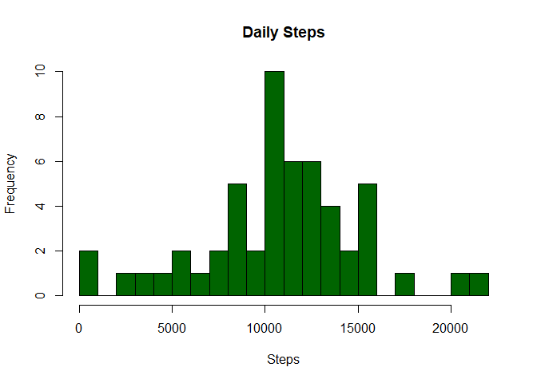
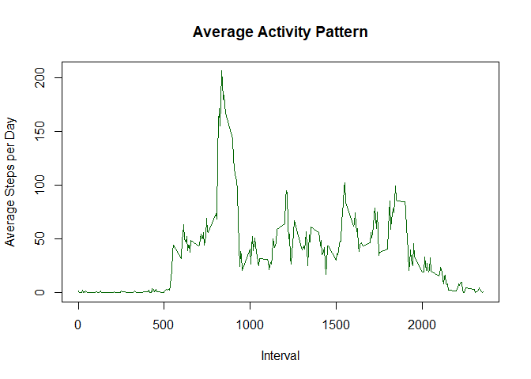
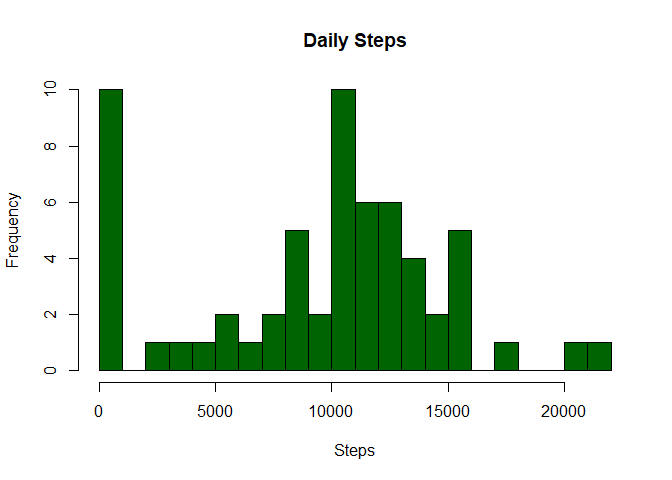
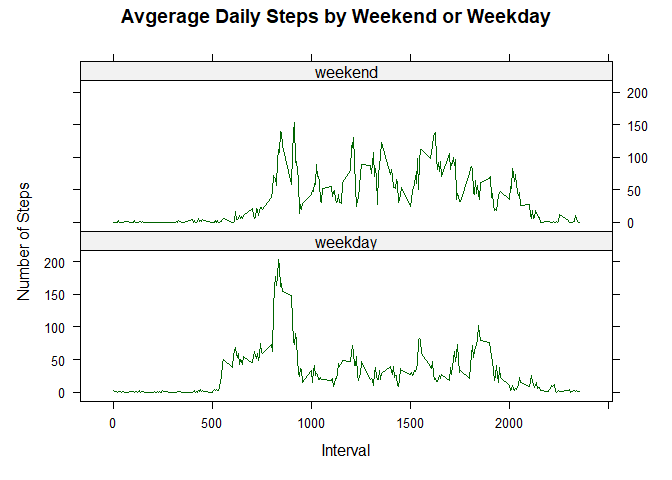

## Loading and preprocessing the data


``` r
# Sets the URL of the ZIP file
url <- "https://d396qusza40orc.cloudfront.net/repdata%2Fdata%2Factivity.zip"

# Defines the destination file path to be the working directory
path_and_file <- paste0(getwd(), '/activity.zip')

# Downloads the ZIP file
download.file(url, path_and_file, method = "curl")

# Unzips downloaded zip file in the working dir
unzip(path_and_file, exdir = getwd())

# Reads the file using read.csv
activity_csv <- read.csv("activity.csv")
```


## What is mean total number of steps taken per day?


``` r
# Aggregates the data by date and calculates total steps
total_steps <- aggregate(steps ~ date, data = activity_csv, FUN = sum, na.rm = TRUE)

# Creates a histogram based on the result of aggregate showing the frequency for the daily steps
hist(total_steps$steps, 
     breaks = 30,
     col = "darkgreen",
     xlab = "Steps",
     ylab = "Frequency",
     main = "Daily Steps")
```

<!-- -->

``` r
# Calculate and report the mean and median of the total number of steps taken per day
mean_steps <- mean(as.numeric(total_steps$steps), na.rm = TRUE)
median_steps <- median(as.numeric(total_steps$steps), na.rm = TRUE)
activity_csv2 <- data.frame(mean_steps = mean_steps, median_steps = median_steps)
activity_csv2
```

```
##   mean_steps median_steps
## 1   10766.19        10765
```


## What is the average daily activity pattern?


``` r
# Calculates the average number of steps for each 5-minute interval
interval_means <- aggregate(steps ~ interval, data = activity_csv, FUN = mean, na.rm = TRUE)

# Makes the time series plot type = l
plot(interval_means$interval, interval_means$steps, type = "l", col = "darkgreen",
     xlab = "Interval", ylab = "Average Steps per Day", main = "Average Activity Pattern")
```

<!-- -->

``` r
# Identify the interval with the maximum average number of steps
int_w_max_steps <- interval_means$interval[which.max(interval_means$steps)]
print(paste("Interval with maximum average number steps:", int_w_max_steps))
```

```
## [1] "Interval with maximum average number steps: 835"
```


## Imputing missing values


``` r
# Calculates and reports the total number of missing values in the data
total_NAs <- sum(is.na(activity_csv$steps))
print(paste("Total number of missing values:", total_NAs))
```

```
## [1] "Total number of missing values: 2304"
```

``` r
# Fills in NAs with the median of the dataset
median_steps <- median(activity_csv$steps, na.rm = TRUE)

# Creates a new dataset that is equal to the original but with the NAs filled in
activity_csv_filled <- transform(activity_csv, steps = ifelse(is.na(steps), median_steps, steps))

# # Aggregates the new filled data by date and calculates total steps
new_total_steps <- aggregate(steps ~ date, data = activity_csv_filled, FUN = sum)

# Mean, median and total number of steps taken per day
mean_steps <- mean(new_total_steps$steps)
median_steps <- median(new_total_steps$steps)
print(paste("Mean total number of steps taken per day:", mean_steps))
```

```
## [1] "Mean total number of steps taken per day: 9354.22950819672"
```

``` r
print(paste("Median total number of steps taken per day:", median_steps))
```

```
## [1] "Median total number of steps taken per day: 10395"
```

``` r
# Creates a histogram of the total nuber of steps taken each day
hist(new_total_steps$steps, 
     breaks = 30,
     col = "darkgreen", 
     xlab = "Steps", 
     ylab = "Frequency", 
     main = "Daily Steps")
```

<!-- -->


## Are there differences in activity patterns between weekdays and weekends?


``` r
library(lattice)

# Convert date varaible to POSIXct format
activity_csv$date <- as.POSIXct(activity_csv$date)

# Creates a new factor variable indicating weekday or weekend
activity_csv$weekday_or_weekend <- ifelse(weekdays(activity_csv$date) %in% c("Saturday", "Sunday"), "weekend", "weekday")
activity_csv$weekday_or_weekend <- as.factor(activity_csv$weekday_or_weekend)


# Fill missing values with median
activity_csv$steps[is.na(activity_csv$steps)] <- median(activity_csv$steps, na.rm = TRUE)

# Calculate the mean number of steps for each 5-minute interval and week type
factored_total_steps <- aggregate(steps ~ interval + weekday_or_weekend, data = activity_csv, FUN = mean)

# Makes a panel plot containing a time series plot of the 5-min interval (x) 
#and the avg # of steps taken averaged across all weekday days or weekend days (y)
xyplot(steps ~ interval | weekday_or_weekend, data = factored_total_steps, type = "l", col = c("darkgreen", "green"),
       xlab = "Interval", ylab = "Number of Steps",
       main = "Avgerage Daily Steps by Weekend or Weekday",
       layout = c(1, 2))
```

<!-- -->
